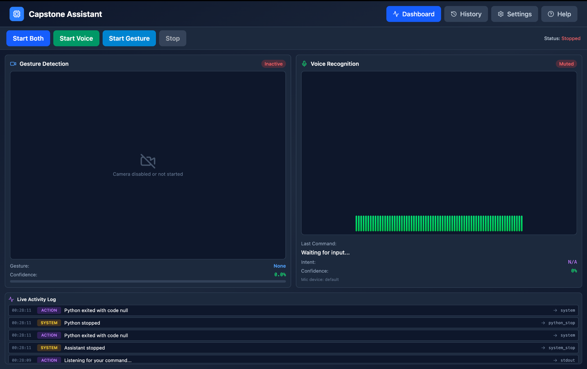
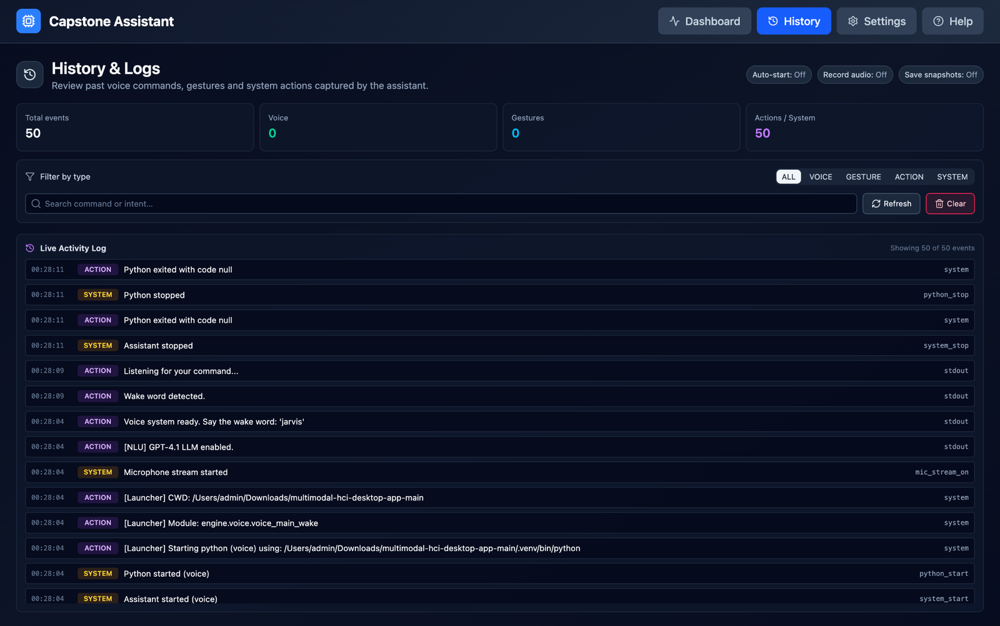
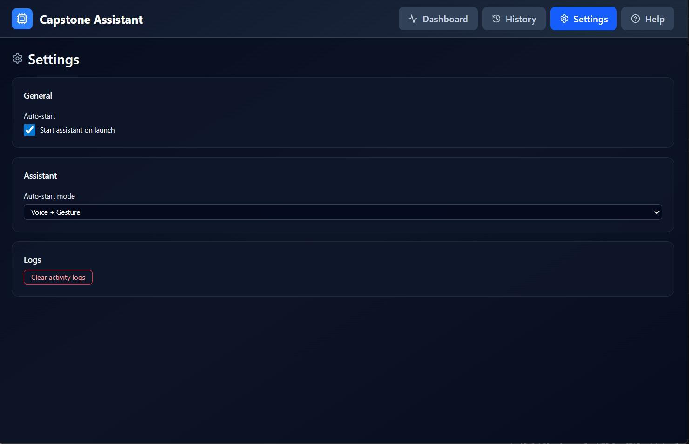
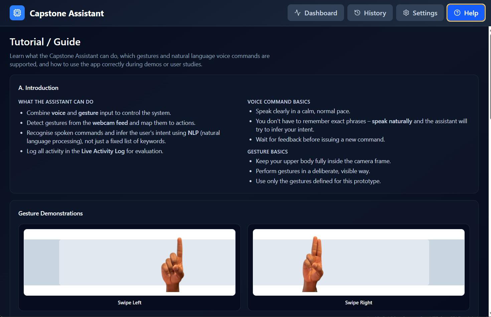
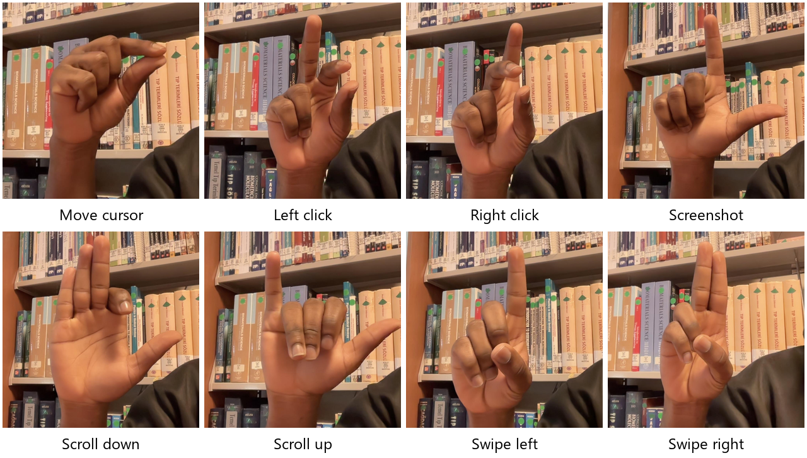
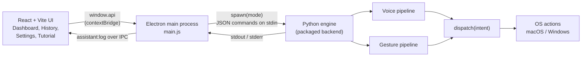
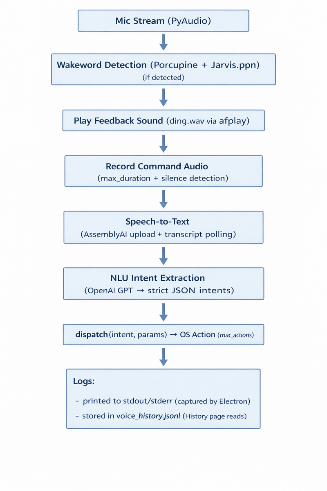
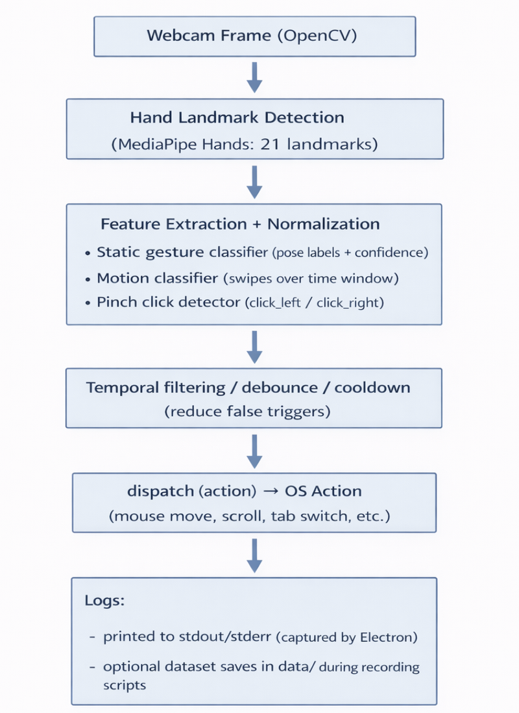

# Multimodal HCI Assistant

**Control a computer with your voice and your hands.** This was our capstone project in the Department of Computer Engineering at Cyprus International University (2025). It is a desktop assistant that listens for a wake word, understands spoken commands in plain language, and reads hand gestures from an ordinary webcam. Both kinds of input end up as the same system actions.

[العربية](#بالعربية) · [Screens](#the-app) · [How it works](#how-it-works) · [My part](#my-part) · [Team](#team) · [Download](#download)

## What it does

- **Voice.** Say "Jarvis" and then talk normally: "open Spotify", "turn the volume up", "set a timer for five minutes", "search who won the match". Nobody has to memorise fixed phrases, because a language model turns the sentence into structured intents. One sentence can also carry several intents, which run in order.
- **Gestures.** Eight hand gestures, tracked live from the webcam: moving the cursor, left and right click, screenshot, scrolling up and down, and swiping left and right between tabs and windows.
- **Three modes.** Voice only, gesture only, or both at once. You start and stop each mode from the dashboard.
- **Visible feedback.** A live activity log shows what the assistant heard, how it read the command, and which action it ran. A history page keeps the log across sessions, with search and filtering.

## The app

| Dashboard | History and logs |
|---|---|
|  |  |
| **Settings** | **Built-in tutorial** |
|  |  |

### Gestures

Cursor, screenshot and scrolling are static poses: hold the pose and the action runs. Clicks are pinch motions. Tap the thumb and index finger together for a left click, or the thumb and ring finger for a right click. The two swipes use slightly different hand shapes, so a swipe in one direction is not mistaken for the other.

## How it works

The app has three layers, each with a clear boundary. The Electron layer is a container and process manager. The React UI only displays state. All recognition happens in a Python engine running as a separate process.

**Voice pipeline.** PyAudio streams the microphone in small frames to Picovoice Porcupine, which listens for the custom "Jarvis" wake word. Once it hears the wake word, the engine plays a short sound and records the command. Recording ends at a maximum length or after a stretch of silence, measured by frame energy. The audio stays in memory as WAV and goes to AssemblyAI for transcription. GPT-4.1 then maps the text to intents. It must answer in strict JSON, and any intent that is not on a whitelist, or that falls below a confidence threshold, is dropped before anything runs.

**Gesture pipeline.** OpenCV reads webcam frames and MediaPipe Hands extracts 21 landmarks per hand. The landmarks are normalised so that hand size and distance from the camera don't matter. Static poses are matched against recorded samples by cosine similarity, and a match needs a very high score. Swipes are detected from the wrist's path over a short rolling window. A gesture only fires after it holds across several consecutive frames, and each one has a cooldown, which removes most accidental triggers.

| Voice pipeline | Gesture pipeline |
|---|---|
|  |  |

Both pipelines call the same `dispatch()` interface, so an action behaves the same whichever way it was triggered. Platform-specific modules turn abstract actions like "volume up" or "switch tab" into real system calls on macOS and Windows.

### Design changes we made on the way

- **From fuzzy matching to an LLM.** Intent matching started as rule-based fuzzy matching, which broke as soon as someone phrased a command differently. Switching to an LLM with a strict output contract fixed that without losing control over which actions can run.
- **From Whisper to AssemblyAI.** We began with Whisper for transcription. For short spoken commands, AssemblyAI gave more consistent accuracy and more predictable latency.
- **From push-to-talk to a wake word.** The first version made you hold a key while speaking. The wake word made the assistant actually hands-free.
- **Fewer, better gestures.** The early gesture set was larger. Every gesture that caused false positives was cut or redesigned, and eight reliable ones were kept.

## My part

I worked on the **integration layer between the Python engine and the Electron app**, and on the **logic that combines voice and gesture results into one decision** when both modes run together.

On the Electron side, that means [`electron/main.js`](electron/main.js) and [`electron/preload.js`](electron/preload.js), which are in this repository:

- Starting the packaged Python backend in the selected mode and streaming its stdout and stderr to the UI over IPC, as the live activity log.
- Sending commands to the running engine as JSON lines on stdin.
- Exposing a small, explicit API to the React UI through `contextBridge` (`startAssistant`, `stopAssistant`, `statusAssistant`, settings, `onLog`), so the renderer never touches Node or the file system directly.
- Clean shutdown. Stopping or switching modes kills the whole backend process tree: `taskkill /T` on Windows, and SIGTERM followed by SIGKILL on macOS and Linux. That way no orphaned Python process keeps holding the camera or microphone. This was one of the harder bugs in the project.
- Tray behaviour, start at login, and persisted settings, including starting the engine automatically in a chosen mode after Windows boots.

## What's in this repository

The full source of the Python engine and the React UI is held by the team. This repository presents the project:

| Path | Contents |
|---|---|
| `electron/` | The Electron main process, preload script and package manifest, taken from the shipped build |
| `docs/MHCI-Thesis.pdf` | The full capstone report: architecture, implementation, testing and limitations |
| `docs/MHCI-Presentation.pdf` | The presentation slides |
| `docs/images/` | Screenshots of the app, pipeline diagrams and the gesture set |

## Download

The Windows installer (`MHCI Assistant Setup 1.0.0.exe`) is attached to the [latest release](../../releases/latest). It is not code-signed, so Windows SmartScreen will ask for confirmation. Gesture mode runs fully on the device with any webcam. Voice mode calls OpenAI, AssemblyAI and Picovoice, and no API keys ship with the build.

## Tech stack

- **Engine:** Python, OpenCV, MediaPipe Hands, NumPy, PyAudio, Picovoice Porcupine, AssemblyAI, OpenAI GPT-4.1, pyttsx3
- **Desktop:** Electron, Node.js `child_process`, IPC and `contextBridge`
- **UI:** React, Vite, Tailwind CSS, Lucide icons
- **Packaging:** electron-builder (NSIS) and a PyInstaller backend

## Team

Capstone project, Department of Computer Engineering, Cyprus International University. Supervised by Prof. Dr. Melike Şah Direkoğlu.

- **Ayomiposi Pelumi Adebayo**, AI engineer
- **Hafeez Ahmed**, software engineer
- **Fiyinfoluwa Emmanuel Akinbo**, software engineer
- **Idiat Abolaji (Bimbo) Adetunji**, computer engineer
- **Wael Saballyl** (Wael Sabe Allil in the report), software engineer

---

## بالعربية

**مساعد لسطح المكتب يتحكم بالحاسوب عبر الصوت وحركات اليد.** هذا مشروع تخرجنا في قسم هندسة الحاسوب بجامعة قبرص الدولية (2025)، وبناه فريق من خمسة أشخاص.

**ما الذي يفعله:**
- **الصوت:** تقول «Jarvis» ثم تتكلم بشكل طبيعي، مثل «افتح Spotify» أو «ارفع الصوت» أو «اضبط مؤقتًا لخمس دقائق». يحوّل نموذج لغوي الجملة إلى أوامر منظّمة، ولا يُنفَّذ إلا ما كان ضمن قائمة الأوامر المسموحة وبدرجة ثقة كافية.
- **حركات اليد:** ثماني حركات تُقرأ مباشرة من كاميرا عادية: تحريك المؤشر، والنقر الأيسر والأيمن، ولقطة الشاشة، والتمرير للأعلى والأسفل، والسحب يمينًا ويسارًا.
- **ثلاثة أوضاع:** صوت فقط، أو حركة فقط، أو الاثنان معًا، مع سجل مباشر يوضح ما سمعه المساعد وكيف فهمه وما الإجراء الذي نفّذه.

**دوري في المشروع:** طبقة الربط بين محرك Python وتطبيق Electron، ومنطق دمج نتائج الصوت والحركة في قرار واحد عند تشغيل الوضعين معًا. يشمل ذلك تشغيل المحرك حسب الوضع المختار، ونقل سجلاته إلى الواجهة لحظيًا، وإيقافه بشكل نظيف دون أن تبقى عمليات معلّقة تحجز الكاميرا أو المايك. ملفات Electron الخاصة بهذا الجزء موجودة في مجلد `electron/`.

الكود الكامل للمحرك والواجهة محفوظ لدى الفريق. يعرض هذا المستودع المشروع من خلال التقرير الكامل والعرض التقديمي وصور التطبيق، ويمكن تنزيل نسخة Windows من صفحة الإصدارات.
